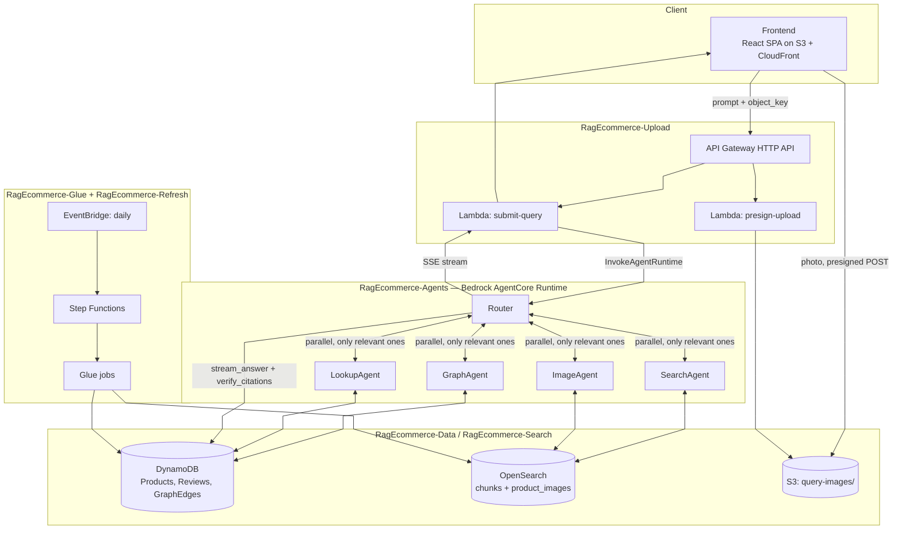
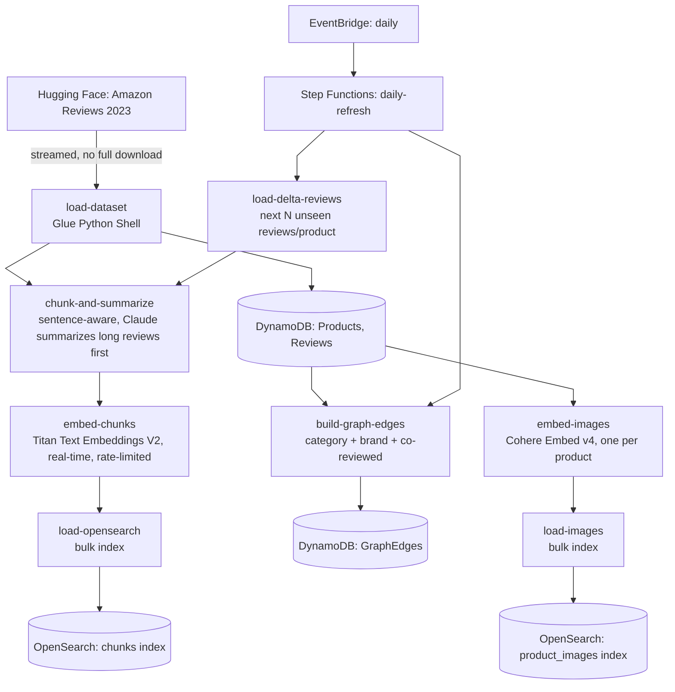
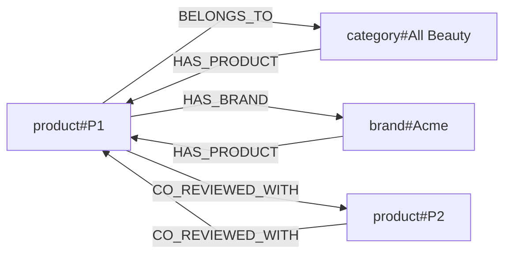
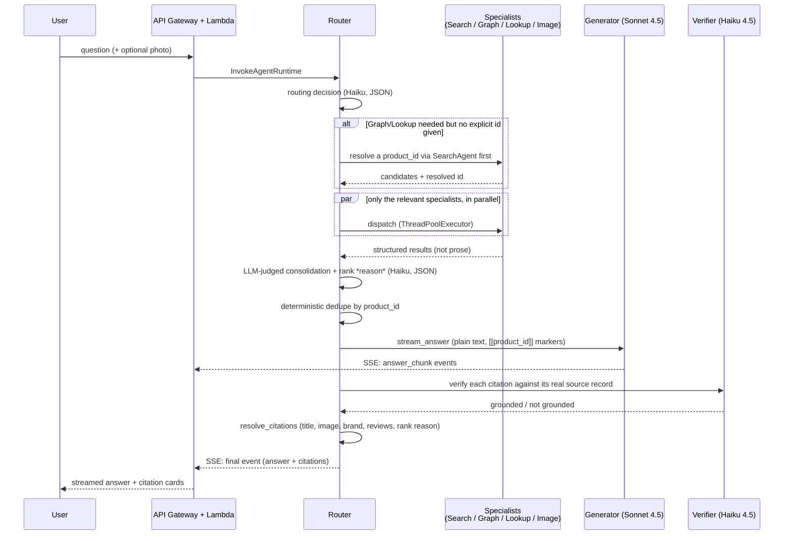

# RAG Multimodal E-commerce

A multimodal, multi-agent RAG assistant over a real e-commerce catalog, built entirely on AWS-native services in `us-east-2`. It answers natural-language product questions — typed, or posed as an uploaded photo — by routing each query to whichever combination of **semantic search**, **graph traversal**, and **visual similarity search** actually applies, fusing the results with an LLM-judged ranking (with a stated *reason* for each rank), and generating a grounded answer whose every claim is citation-checked against the retrieved record before it reaches the user.

Every architectural decision below was either forced by a real constraint hit against this AWS account (a blocked service, a missing model, an unsupported region) or resolved by a real experiment against real data — not assumed. Where a decision deviates from an earlier plan, that's flagged explicitly rather than left for the code and the docs to quietly drift apart. The `docs/designs/` and `docs/experiments/` directories are the full record; this README is the synthesized, high-level map of it.

**Dataset**: [McAuley Lab "Amazon Reviews 2023"](https://amazon-reviews-2023.github.io/), All Beauty category — 5,000 products, 10,500+ reviews, 24,000+ product images, streamed from Hugging Face (no full download).

**Live demo**: [https://d1vjoz7ow6cljs.cloudfront.net](https://d1vjoz7ow6cljs.cloudfront.net)

---

## System architecture



**Tech stack**

| Layer | Service | Notes |
| --- | --- | --- |
| Frontend | S3 + CloudFront (Origin Access Control) | React + TypeScript SPA, private bucket, no public S3 access |
| API | API Gateway (HTTP API) + Lambda | Presigned image upload, query submission, CORS to the SPA |
| Agent orchestration | Bedrock AgentCore Runtime | 5 containers (4 specialists + router), hand-rolled Claude tool-use loops |
| Structured metadata + graph | DynamoDB | Products, Reviews, and a single adjacency-list `GraphEdges` table — not Neptune (unsupported on this account's plan) |
| Hybrid + vector retrieval | Amazon OpenSearch Service | BM25 + k-NN + structured filters, single-node provisioned (not Serverless — see cost) |
| Embeddings + generation | Amazon Bedrock | Titan Text Embeddings V2 (text), Cohere Embed v4 (images), Claude Haiku 4.5 (routing/specialists/verification), Claude Sonnet 4.5 (answer generation) |
| Ingestion / ETL | AWS Glue (Python Shell) + Step Functions + EventBridge | One-time load + a real daily delta-refresh cadence |
| Observability | CloudWatch (dashboard + alarms) + AWS Budgets | Real infra metrics and a custom `RAGEcommerce/Eval` namespace for retrieval/groundedness scores |
| Region / account | `us-east-2` / `953146692069` | |

---

## Core AI capabilities

### 1. Graph RAG, multi-agent orchestration

Rather than one agent juggling every retrieval tool itself, a **router** classifies each question against four independent, single-purpose **specialist agents** and dispatches only the ones that apply, in parallel:

- **SearchAgent** — hybrid semantic + keyword search
- **GraphAgent** — knowledge-graph traversal (brand, category, co-reviewed relationships)
- **ImageAgent** — visual similarity search from an uploaded photo
- **LookupAgent** — exact-id retrieval

This is a genuine **Graph RAG** setup: GraphAgent doesn't retrieve raw text, it walks a real knowledge graph (see [Knowledge graph construction](#knowledge-graph-construction) below) and returns *structured relationships* — "same brand as X," "co-reviewed with X" — which get fused into the same ranked context as SearchAgent's semantic hits before generation. A question like *"tell me about this product, and what else does the brand make"* genuinely needs both a direct lookup **and** a graph hop, dispatched together, not sequentially guessed at.

**Why multiple agents instead of one agent with four tools**: each specialist stays small, independently testable, and individually verifiable against real AWS calls — the router's own job simplifies to "which sources apply," not "how do I correctly call four different backends." The real tradeoff (more Bedrock calls per query) was accepted deliberately since latency isn't a hard constraint for this project. See [design doc 02](docs/designs/02-retrieval-agents.md#why-multi-agent-not-single-agent-with-tools) for the full reasoning, including why classic AWS Bedrock Agents (the seemingly obvious choice) was ruled out by a real `AccessDeniedException` (the service is in maintenance mode, closed to new accounts) — agents here run hand-rolled Claude tool-use loops (Bedrock Converse API) hosted on **Bedrock AgentCore Runtime**, not the declarative multi-agent-collaboration feature.

**A real gap found live, and fixed**: GraphAgent and LookupAgent can only traverse/fetch by *exact* `product_id` — they have no by-name search of their own. Early on, a shopper describing a product by name ("that charcoal soap bar") made the router correctly dispatch GraphAgent, which then silently returned zero results every time, because it had nothing to traverse from. Fixed in the router: whenever GraphAgent/LookupAgent are dispatched without an explicit id already in the question, the router runs SearchAgent first (even if the router itself didn't ask for it) to resolve a real `product_id` from the shopper's own description, then hands that id to GraphAgent/LookupAgent. Verified live against a real multi-product brand — the resolved id let GraphAgent correctly return its actual siblings.

### 2. Semantic ("closeness") search via vector embeddings

Every product description, review, and a synthesized tag summary is embedded with **Titan Text Embeddings V2** (1024-dim) and indexed into OpenSearch alongside structured filter fields (price, rating, brand, category). SearchAgent runs OpenSearch's **native `hybrid` query** — a `min_max`-normalized, equal-weighted (0.5/0.5) combination of BM25 keyword score and k-NN cosine similarity — not a naive summed `bool(knn, match)`, which a real experiment ([Experiment 04](docs/experiments/04-indexing-strategy.md)) proved silently degrades to keyword-only search (unbounded BM25 scores drown the bounded 0.6–0.7 cosine scores in a raw sum). The fusion weighting itself was tuned in a follow-up experiment ([Experiment 05](docs/experiments/05-searchagent-fusion-method.md)) against weighted RRF and BM25/kNN-only baselines.

Structured constraints ("under $15," "4 stars and up") are extracted by the agent into real OpenSearch `filter` clauses — never left as unenforced free text — so a query like *"gentle moisturizer for sensitive skin under $15"* combines a real price range with genuine semantic matching in one round trip.

### 3. Image search via image vector embeddings

A shopper can upload a photo instead of (or alongside) typing. The image is embedded with **Cohere Embed v4** (`us.cohere.embed-v4:0`, 1024-dim — capped down from Cohere's 1536 default to fit OpenSearch's `lucene` k-NN engine, confirmed by a real `400` on the first attempt) and matched via k-NN against a dedicated `product_images` OpenSearch index — one real embedding per product's primary image, all 5,000 of them. `amazon.titan-embed-image-v1` was the original plan; it simply isn't offered on this account in this region, confirmed by checking `list-foundation-models` directly rather than assuming.

ImageAgent embeds the photo *eagerly*, before its tool-use loop even starts — unlike SearchAgent, which waits for Claude to first extract a query from text, a photo has no extraction step; the image already *is* the complete query. Verified live: querying with a real indexed product's own photo returns that exact product as the top hit (self-match, score 1.0) plus genuinely similar items from other brands, and image-derived visual matches compose correctly with text-derived filters ("...only from brand X") in the same request.

### 4. How reviews are used

Reviews are a first-class retrieval source, not an afterthought, at three separate points in the pipeline:

- **At ingestion**: every review becomes its own chunk (long reviews are summarized by Claude before sentence-aware splitting), embedded and indexed into the same `chunks` index as product descriptions — so SearchAgent can surface a specific customer claim ("battery lasts through a full shave") as directly as a spec-sheet fact.
- **In the knowledge graph**: `CO_REVIEWED_WITH` edges connect two products reviewed by the same person — a real, derived proxy for "goes with this," substituted honestly for the dataset's actually-empty `bought_together` field rather than silently faked. Sparse (448 edges from 87 repeat reviewers across 10,500+ reviews) but real.
- **On the answer itself**: every cited product's card is enriched with up to two real customer reviews (rating + text), fetched with a single cheap DynamoDB query (`Reviews` table, partition key `product_id`) at citation-resolution time — giving the shopper independent evidence alongside the generator's own claim, not just the model's paraphrase of it.

---

## Ingestion pipeline



A Step Functions state machine sequences the core stages; a **daily EventBridge schedule** triggers a real delta-refresh cadence on top of the one-time initial load — not a single bulk import. Each delta run re-streams the dataset, selects up to 200 not-yet-loaded reviews (capped at 1 per product) via a pure, unit-tested selection function, and pushes them through the same chunk → embed → index pipeline as new data, then rebuilds the graph edges. Verified with a real, *unprompted* execution (EventBridge `rate()` rules fire once immediately on creation) that moved real numbers: **DynamoDB reviews 10,313 → 10,513**, **OpenSearch `chunks` 20,339 → 20,539**, **`GraphEdges` 19,458 → 19,476**.

**Chunking strategy** was resolved by experiment, not assumed: sentence-aware splitting (pack whole sentences into a ~300-word budget, never cut mid-sentence) beat fixed-size word-count splitting with overlap on both a structural proxy ([Experiment 01](docs/experiments/01-chunking-strategy.md): 100% clean sentence boundaries vs. 90.9%) and, later, on *real retrieval* against a live OpenSearch index ([Experiment 03](docs/experiments/03-chunking-retrieval-validation.md): hit-rate@5 of 0.867 vs. 0.800).

**Two real constraints forced deviations from the original plan**, both flagged rather than silently absorbed:
- **Bedrock Batch inference is blocked account-wide** (confirmed by a real, rejected `create-model-invocation-job` submission) — bulk embedding runs real-time instead, parallelized with a rate limiter against each model's actual on-demand quota (540 req/min for Titan, 180 req/min for Cohere).
- **The dataset's `bought_together` field is empty for every product** — graph edges use a derived `CO_REVIEWED_WITH` signal instead (see [Reviews](#4-how-reviews-are-used) above), not silently mislabeled as literal co-purchase data.

Full detail: [design doc 01](docs/designs/01-ingestion-pipeline.md).

## Knowledge graph construction



No Neptune: a real deploy attempt failed outright (`CREATE_FAILED`, this account's plan doesn't support it — only `aurora-postgresql`), and the graph queries this system actually needs (1–2 hop lookups: "same brand," "same category," "co-reviewed") don't justify a second stateful graph database anyway. The graph lives as a **DynamoDB adjacency-list**: one table, partition key `node` (`"product#P1"`, `"brand#Acme"`, `"category#All Beauty"`), sort key `edge` (`"HAS_BRAND#brand#Acme"`). Every relationship is written in both directions at ingestion time, so **every traversal GraphAgent needs is a single-partition `Query`** — no GSI, no second index to keep in sync, no multi-hop fan-out.

Three real edge types, derived from what the dataset actually contains (verified field-by-field before building around it — `bought_together` and `categories` are both empty for every product in this release):

| Edge type | Hops | Source | Real count |
| --- | --- | --- | --- |
| `BELONGS_TO` / `HAS_PRODUCT` | 1 | `main_category` (flat — only 2 distinct values) | 5,000 + 9,505 |
| `HAS_BRAND` / `HAS_PRODUCT` | 1 | `store` field (3,386 distinct brands — the richest signal) | 4,505 |
| `CO_REVIEWED_WITH` | 1 (symmetric) | Same reviewer across ≥2 loaded products | 448 |

GraphAgent exposes exactly three relation types mapped to these edges — never a generic "traverse the graph" tool — so *how many hops* and *which edge type* stay deterministic in code rather than left for the model to improvise per query. `same_brand`/`same_category` are genuinely 2-hop (product → brand/category node → sibling products); `co_reviewed` is 1-hop, since those edges are already written product-to-product directly.

Full detail: [design doc 01](docs/designs/01-ingestion-pipeline.md#graph-storage-dynamodb-not-neptune).

## Multi-agent retrieval, ranking & generation



**Consolidation is split into two mechanisms on purpose**, not one: the four specialists return results on *incomparable scales* (an OpenSearch relevance score, a k-NN similarity score, a graph edge with no score at all, a direct lookup with no ranking at all) — so *ranking* is a judgment call handed to an LLM (with a **stated reason per product**, not just a bare order — the "why this rank" text shown on every card), while *deduplication* (the same product surfacing from two specialists) is an exact-match check on `product_id`, done deterministically in code, since LLMs aren't reliable at exhaustively deduping a list by exact key.

**Answers stream, not just fetch-then-render**: the generator writes plain text with inline `[[product_id]]` citation markers rather than a single JSON blob — JSON doesn't stream usefully, a client can't render a half-formed object. The AgentCore entrypoint is a Python generator; the SDK auto-detects it and streams real server-sent events back to the client. **Every claim gets fact-checked before the user sees it**: a second, cheaper Claude call (Haiku, not Sonnet — verifying groundedness is a strictly easier task than drafting the answer) checks each citation's claim against the specialist's actual retrieved record and silently drops any that don't hold up — this is what catches "hallucinated confidence despite citations," a real failure mode distinct from citing nothing at all.

**Product names are kept out of the generated prose entirely** — the generator is instructed to refer to products generically ("one option," "another product") and let the citation card (title, brand, image, review, rank reason) carry the name, since repeating it in the sentence is redundant and the card is the actual source of truth.

Full detail: [design doc 02](docs/designs/02-retrieval-agents.md), [design doc 04](docs/designs/04-inference-serving.md) (streaming, retry/timeout).

---

## Agent configuration reference

Every setting below was either decided by a real experiment or a reasoned, documented call — never a default left unexamined. Full prompts (verbatim) are in [design doc 02](docs/designs/02-retrieval-agents.md).

| Agent | Model | Tool(s) | Key settings | How it was decided |
| --- | --- | --- | --- | --- |
| **Router** — routing | Claude Haiku 4.5 | — (classification only) | Single-turn JSON call; `image_agent` force-disabled in code if no photo was actually uploaded | Reasoned: a deterministic code guard is more reliable than trusting the model never to hallucinate a photo that isn't there |
| **Router** — consolidation | Claude Haiku 4.5 | — (ranking only) | Single-turn JSON call; returns `{product_id, reason}` per kept candidate, not just an order | Reasoned: the four specialists' scores are on incomparable scales (see above) — no formula to tune, so this is a judgment call, made explainable |
| **SearchAgent** | Claude Haiku 4.5 (loop) + Titan Text Embeddings V2 (query embed) | `search_products` — hybrid + structured filters | `MAX_TURNS=4`; native `hybrid` query, `min_max` normalization, 0.5/0.5 weighting | [Experiment 04](docs/experiments/04-indexing-strategy.md) rejected naive summed scoring; [Experiment 05](docs/experiments/05-searchagent-fusion-method.md) tuned the fusion weighting against weighted RRF and BM25/kNN-only |
| **GraphAgent** | Claude Haiku 4.5 (loop) | `find_related_products(product_id, relation)` — 3 relation types, not a general traversal tool | `MAX_TURNS=4`; relation type is an enum, not free text, so hop count stays deterministic in code | Reasoned: encodes "how many hops per relation" in code rather than leaving it to the model per query |
| **ImageAgent** | Claude Haiku 4.5 (loop) + Cohere Embed v4 (image embed, 1024-dim) | `find_visually_similar_products` — pure k-NN, no text component | `MAX_TURNS=4`; image embedded *eagerly*, before the tool loop starts | Model forced by real account availability (Titan Multimodal not offered); dimension forced by a real `400` against OpenSearch's `lucene` cap |
| **LookupAgent** | Claude Haiku 4.5 (loop) | `get_product` / `get_review` — exact id only | `MAX_TURNS=4`; explicit negative constraints ("you do not search, filter, rank, or guess") | Verified directly: without the negative constraints, a generically-helpful Claude tried to recommend products instead of declining out-of-scope requests |
| **Generator** | Claude Sonnet 4.5 | `stream_answer` | Streams plain text + `[[product_id]]` markers; never states a product name in prose | Corrected mid-build from an earlier draft that (wrongly) specified Sonnet for the verifier too |
| **Verifier** | Claude Haiku 4.5 | `verify_citations` | Strict grounded/not-grounded per citation, against the real source record | Cheaper model deliberately — grounding-verification is an easier task than drafting the answer |

Every specialist shares one retry/timeout policy (`src/agents/bedrock_client.py`): boto3 `standard` retry mode (built-in exponential backoff + jitter on Bedrock throttling) and a per-call timeout tuned to what's actually being called — 10s for a single Converse turn, 20s for a router→specialist dispatch (a full multi-turn agent run), 55s for an external caller invoking the router's entire pipeline end-to-end. On timeout, the system degrades gracefully — returns whatever was already collected — rather than failing the whole request.

## What experiments determined

| # | Question | Method | Result | Decision |
| --- | --- | --- | --- | --- |
| [01](docs/experiments/01-chunking-strategy.md) | Sentence-aware vs. fixed-size word-count chunking? | 40 real reviews, % clean sentence-boundary | 100% vs. 90.9% clean boundaries | Sentence-aware, ~300-word budget |
| [02](docs/experiments/02-summarization-prompting.md) | Best prompt for summarizing long reviews before chunking? | LLM-as-judge over 3 candidates | Blocked initially on model access; later resolved | Best-scoring candidate adopted |
| [03](docs/experiments/03-chunking-retrieval-validation.md) | Does sentence-aware chunking still win on *real retrieval*, not just structural proxy? | 300 real reviews, 30 synthetic queries, real OpenSearch index, precision@5 / hit-rate@5 | 0.867 vs. 0.800 hit-rate@5 | Confirmed sentence-aware |
| [04](docs/experiments/04-indexing-strategy.md) | Is naive `bool(knn, match)` hybrid scoring safe to ship? | Same corpus/queries, 4 combination methods compared | Naive hybrid ≡ BM25-only to 3 decimals (unbounded BM25 drowns bounded cosine scores) | Rejected naive summation |
| [05](docs/experiments/05-searchagent-fusion-method.md) | What should SearchAgent's real fusion method be? | Weighted RRF vs. OpenSearch native `hybrid` (min_max normalization), several weightings | Native hybrid ties BM25 on hit-rate (0.967), small precision gap plausibly a query-methodology artifact | Native `hybrid`, 0.5/0.5 weighting |
| [06](docs/experiments/06-production-eval.md) | Does the *deployed, end-to-end* system actually retrieve and ground correctly? | 20 real queries against the live API, independent LLM judge (never sees the production verifier) | 85% recall, but only 45% of answers scored predominantly grounded by the independent judge | Surfaced a real citation-snippet traceability gap (see [Known limitations](#known-limitations)) |

## Real production numbers

| Metric | Value |
| --- | --- |
| Products loaded | 5,000 |
| Reviews loaded | 10,513 (after one real delta-refresh cycle) |
| Text chunks indexed | 20,539 |
| Product images embedded | 5,000 (one per product) |
| Graph edges | 19,476 |
| Distinct brands | 3,386 |
| Production eval recall (n=20, real queries against the live API) | 85% |
| Production eval citation grounding rate (independent judge) | 45% — see [Known limitations](#known-limitations) |
| Monthly cost target | Under $100 (AWS Budget configured with 80%/100% alerts) |

---

## Repository structure

```
docs/
  designs/       one detailed design doc per workflow — decisions, reasoning, real gotchas
  experiments/   every experiment that resolved an open design question, with method + results
  PROGRESS.md    what's implemented, what's verified, what's still open
src/
  ingestion/     chunking, summarization, DynamoDB/OpenSearch writers, graph-edge derivation
  agents/        the 4 specialists + router + generator/verifier (AgentCore runtimes + shared tool loop)
  api/           presigned upload + query submission Lambdas
scripts/
  eval/          the production evaluation harness (Experiment 06)
  experiments/   throwaway scripts backing experiments 01, 03-05
tests/           unit tests, run without AWS credentials (moto-mocked DynamoDB, stubbed Bedrock/OpenSearch)
frontend/        React + TypeScript SPA (Vite)
infra/           AWS CDK (Python) — one stack per workflow
```

## Development

```bash
python3 -m venv .venv
source .venv/bin/activate
pip install -e ".[dev]"
pytest
```

## Infrastructure

AWS CDK (Python), one stack per workflow — see [PROGRESS.md](docs/PROGRESS.md#infrastructure-infra) for what's deployed. `cdk.json` points `cdk` at `../.venv/bin/python3` directly, so the venv doesn't need activating first — just run `pip install -e ".[infra]"` in it once.

```bash
pip install -e ".[infra]"
cd infra && npm install
npx cdk synth          # generates CloudFormation templates, no AWS credentials needed
npx cdk bootstrap      # one-time per account/region, needs AWS credentials
npx cdk deploy --all   # needs AWS credentials configured, and starts real billing
npx cdk destroy --all  # tear down between work sessions — see the cost discipline in docs/designs/05-observability-cost.md
```

## Design docs

- [01 — Ingestion & Refresh Pipeline](docs/designs/01-ingestion-pipeline.md)
- [02 — Retrieval Agents & Query Orchestration](docs/designs/02-retrieval-agents.md)
- [03 — Image Upload & Multimodal Query](docs/designs/03-image-upload.md)
- [04 — Inference Serving](docs/designs/04-inference-serving.md)
- [05 — Observability & Cost Controls](docs/designs/05-observability-cost.md)
- [06 — Frontend Hosting](docs/designs/06-frontend-hosting.md)

See [docs/PROGRESS.md](docs/PROGRESS.md) for full implementation status, real verification results, and every gotcha hit along the way.

## Known limitations

Reported honestly, not smoothed over — these are real findings from the production eval and live usage, with concrete next steps identified:

- **Citation grounding rate (45%, [Experiment 06](docs/experiments/06-production-eval.md))**: the citation snippet shown alongside a claim is the sentence the generator itself wrote, not a quote pulled from the underlying product record — so an independent judge correctly flags it as circular evidence even when the server-side verifier already confirmed the claim is grounded. The concrete fix (have citation resolution substitute a real excerpt from the product's own record) is scoped but not yet built; real customer reviews were added to each card as a partial, real mitigation in the meantime.
- **Chunk granularity ("small-to-big")**: still open — indexing small, precise chunks for matching but expanding to a larger context window before generation. Can't be validated with retrieval-only metrics; needs a dedicated comparison run through the production eval harness.
- **Eval set scale**: the production eval ran 20 synthetically-labeled queries, not the originally-designed 50–100 hand-labeled pairs — the harness scales mechanically, it just needs the added Bedrock spend and human rating effort to be worth it.
- **Frontend image upload**: verified by code (identical, already-proven API calls) and visually confirmed to render and respond, but not driven end-to-end by browser automation, since headless tooling can't operate a native OS file-picker dialog.

## Cost

Target: under $100/month total AWS spend — the dominant constraint behind several choices here (provisioned OpenSearch over Serverless, DynamoDB over Neptune, real-time embedding over the blocked Batch API, a 5,000-product dataset cap). A real AWS Budget with 80%/100% SNS-notified thresholds is deployed and live. See [Observability & Cost Controls](docs/designs/05-observability-cost.md).
