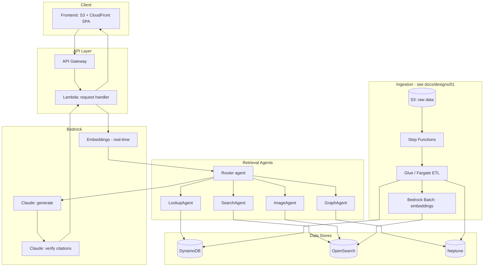

# RAG Multimodal E-commerce

A multimodal RAG assistant over e-commerce product data, built entirely on AWS-native services. It answers natural-language questions about products — and questions posed as an uploaded photo — by combining structured filtering, hybrid text+vector search, and knowledge-graph traversal, then generates a cited answer instead of free-floating prose.

**Dataset**: [McAuley Lab "Amazon Reviews 2023"](https://amazon-reviews-2023.github.io/) — product metadata, review text, and product images (5,000-product subset).

## Architecture



**Tech stack**

| Layer | Service | Notes |
| --- | --- | --- |
| Frontend | S3 + CloudFront | Static SPA |
| API | API Gateway + Lambda | Entry point, CORS to the SPA |
| Structured metadata | DynamoDB | Product / review records, pay-per-use |
| Hybrid retrieval | Amazon OpenSearch Service | BM25 + k-NN + structured filters, provisioned (not Serverless) |
| Knowledge graph | Amazon Neptune | Category hierarchy, co-purchase, brand edges, provisioned |
| Embeddings + generation | Amazon Bedrock | Titan embeddings, Claude generation + verification |
| Ingestion / ETL | AWS Glue or Fargate + Step Functions | Batch load and periodic delta refresh |
| Region | us-east-2 | |

## Repository structure

```
docs/
  designs/     one detailed design doc per workflow: decisions + reasoning
  PROGRESS.md  what's implemented, what's next
src/           implementation, added as each workflow is built
```

## Design docs

Each major workflow has its own design doc covering the architecture, the decisions made, and why:

- [01 — Ingestion & Refresh Pipeline](docs/designs/01-ingestion-pipeline.md)
- [02 — Retrieval Agents & Query Orchestration](docs/designs/02-retrieval-agents.md)
- [03 — Image Upload & Multimodal Query](docs/designs/03-image-upload.md)
- [04 — Inference Serving](docs/designs/04-inference-serving.md)
- [05 — Observability & Cost Controls](docs/designs/05-observability-cost.md)
- [06 — Frontend Hosting](docs/designs/06-frontend-hosting.md)

See [docs/PROGRESS.md](docs/PROGRESS.md) for implementation status.

## Development principles

- Direct, clean code — no speculative abstractions or unused flexibility
- Comments only where the *why* isn't obvious from the code itself (a constraint, a workaround, a non-obvious invariant) — not restating what the code does
- No debug/trace logging left in committed code; structured logs only at meaningful operational boundaries (a request handled, a pipeline stage completed, an error)

## Cost

Target: under $100/month total AWS spend, which is the dominant constraint behind several choices in this design (provisioned over Serverless, a 5,000-product dataset, smallest instance sizes throughout). See [Observability & Cost Controls](docs/designs/05-observability-cost.md).
