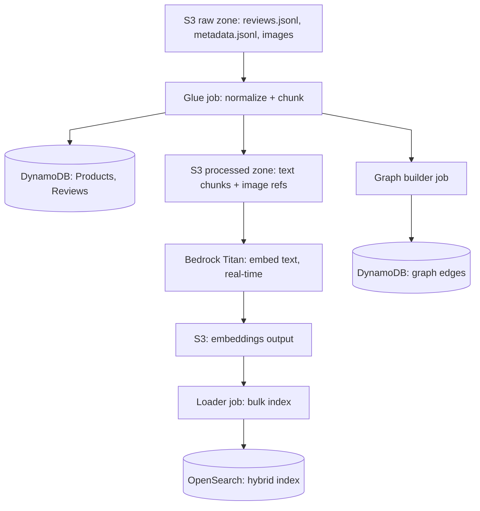

# 01 — Ingestion & Refresh Pipeline

## Overview

Loads the Amazon Reviews 2023 dataset (5,000 products, plus their reviews and images) from S3 into DynamoDB and OpenSearch, and supports periodic incremental refreshes on top of the initial load — not a single one-time import.

**Addresses**: FR4 (periodic data refresh), NFR-3 (scale: 5,000-product cap), NFR-4 (reliability/idempotency), NFR-1 (cost).

## Data flow

**Steps**:
1. Download the dataset into the S3 raw zone
2. Glue job normalizes raw records into product/review rows, writes them to DynamoDB, and produces chunked text ready for embedding in the S3 processed zone
3. Embedding job calls Bedrock Titan in real time for every text chunk, writing vectors back to S3 (Batch inference was the original plan — see below for why that changed)
4. Loader job bulk-indexes chunks + vectors + metadata into OpenSearch
5. Graph builder job derives edges from category hierarchy and "also bought / also viewed" fields, writes them into the DynamoDB graph-edges table

A Step Functions state machine sequences steps 2–5.

## Decisions & reasoning

### Chunking strategy

**Resolved by experiment**: sentence-aware splitting (pack whole sentences into a ~300-word budget, never cut mid-sentence, no overlap needed) — not fixed-size word-count splitting with overlap, which was the original spec here. See [Experiment 01](../experiments/01-chunking-strategy.md) for the comparison and why; implemented in `src/ingestion/chunking.py`.

| Content | Approach | Why |
| --- | --- | --- |
| Product descriptions | Embed whole if under ~300 words; otherwise sentence-aware split into ~300-word chunks | Most descriptions are short enough to need no splitting at all |
| Reviews | One chunk per review in most cases; long reviews sentence-aware split at the same budget | Reviews are typically short; splitting only when needed keeps chunk count down |
| Tags/attributes (brand, category, color, size) | Not chunked as free text — stored as structured metadata on every chunk (see OpenSearch filtering below); additionally rendered as one synthetic sentence per product (e.g. "Black leather wireless over-ear headphones by Sony") and embedded | Lets attribute-phrased semantic queries match, without treating structured facts as prose |
| Images | One embedding per **primary** image per product (not every image), no chunking — see "Image embeddings" below for why the scope is narrower than originally planned | Images aren't decomposable the way text is |

### Image embeddings: Cohere Embed v4, one per product

**Deviation from the original design**, forced by model availability, not chosen: `amazon.titan-embed-image-v1` (Titan Multimodal Embeddings) isn't offered on this account in us-east-2 — `aws bedrock list-foundation-models` lists only `amazon.titan-embed-text-v2:0` (text) and `cohere.embed-v4:0` (text + image) for embeddings. **Resolved: `cohere.embed-v4:0`** via inference profile `us.cohere.embed-v4:0` (confirmed `ACTIVE`), called real-time the same way Titan text embeddings are — request body `{"images": ["data:image/jpeg;base64,<...>"], "input_type": "image", "embedding_types": ["float"], "output_dimension": 1024}`, response at `embeddings.float[0]`, verified against a real product image before building the pipeline around it. **`output_dimension: 1024`, not Cohere's 1536 default** — a real first run hit `400 mapper_parsing_exception: "Dimension value cannot be greater than 1024 for vector"`, since OpenSearch's `lucene` k-NN engine (chosen for the text index) caps vector dimension at 1024; requesting 1024 directly from Cohere avoided adding a second ANN engine just for this index. Image embeddings still live in their own OpenSearch index (`product_images`), not the `chunks` index — same dimension as Titan's text embeddings by coincidence, not the same vector space, so they can't share an index either way. See `src/ingestion/opensearch_documents.py`.

**Also scoped down from "every image" to "one (the first) image per product"**: the 5,000 loaded products carry 24,062 images total. Cohere Embed v4's on-demand quota is 200 requests/min (`aws service-quotas list-service-quotas --service-code bedrock`) — lower than Titan text's 600/min — so embedding every image would take roughly 2.5-3 hours against ~33 minutes for one per product. Disproportionate to what a demo needs (ImageAgent just needs something real to match against per product), consistent with the proportionality calls made elsewhere in this design (e.g. Aurora PostgreSQL vs. DynamoDB for graph storage).

Run via `start-job-run`: `rag-ecommerce-embed-images` (`infra/glue_scripts/embed_images.py`) downloads each product's primary image and embeds it, writing to S3; `rag-ecommerce-load-images` (`infra/glue_scripts/load_images.py`) bulk-indexes into the `product_images` OpenSearch index — same embed/load split as the text pipeline.

Every chunk gets a deterministic id (`{product_id}#{chunk_index}`) carrying `product_id` as metadata, so any retrieved chunk traces back to its source product (and review id, for reviews).

### Embedding generation: real-time Titan calls, not Bedrock Batch

**Deviation from the original design**, forced by the account, not chosen: the original plan was Bedrock Batch for bulk ingestion (roughly half the cost of on-demand, built for exactly this — submit a manifest in S3, get vectors back in S3, no throttling from a tight real-time loop) and real-time only for query-time embedding.

Tested directly against this AWS account (953146692069) and confirmed blocked two ways:
- `aws bedrock list-foundation-models` shows `BATCH` in `inferenceTypesSupported` for **zero** models, in both us-east-1 and us-east-2 — not a Titan-specific gap
- An actual `create-model-invocation-job` submission (with Claude, to rule out an embedding-model-specific issue) was rejected outright: *"Your account is not authorized to perform this action. Please create a support case..."*

This is an account-level authorization gate for the Batch inference feature itself, separate from ordinary model access, and needs an AWS support case (business justification) to lift — not something fixable in code or IaC.

**Resolved: real-time Bedrock Titan calls for bulk ingestion too**, not just query-time. At ~20,000 chunks this is a `ThreadPoolExecutor`-parallelized loop (see `infra/glue_scripts/embed_chunks.py`), not a single-threaded one — sequential calls at network latency would risk the Glue job's timeout. The cost difference versus Batch's ~50% discount is negligible at this dataset's scale (pennies either way against the $100/month cap), so this isn't a real regression, just a different mechanism than planned. If the support case is ever approved, this is a small, isolated change to swap back.

If the embedding model changes, re-run this job over the full corpus rather than patching individual vectors — this avoids two incompatible embedding spaces coexisting in the same index.

### Graph storage: DynamoDB, not Neptune

The design originally specced Amazon Neptune for the knowledge graph, with a DynamoDB adjacency-list as a cost-saving fallback (see [05](05-observability-cost.md)). A real deploy attempt settled it: this AWS account is on a plan that doesn't support Neptune at all — `CREATE_FAILED` on `AWS::Neptune::DBCluster` with *"The specified cluster engine type is not available with free plan accounts. Available engine types: [aurora-postgresql]"*. Aurora PostgreSQL (with an extension like Apache AGE) was the available alternative, but that's a new stateful service with its own always-on cost for graph queries that are just 1–2 hop lookups — disproportionate to the need.

**Decision**: DynamoDB adjacency-list is now the only graph implementation, not a fallback. One table, `GraphEdges`:
- `node` (partition key) — `"product#P1"`, `"category#Electronics"`, `"brand#Acme"`
- `edge` (sort key) — `"{edge_type}#{target}"`, e.g. `"BELONGS_TO#category#Electronics"`, `"CO_REVIEWED_WITH#product#P2"`

Symmetric relationships (brand, category, co-reviewed) are written in both directions at ingestion time, so every traversal GraphAgent needs — "everything connected to this node" — is a single-partition `Query`, no GSI and no second index to keep in sync.

### Graph edges: `CO_REVIEWED_WITH`, not `CO_PURCHASED_WITH`

**Deviation from the original design**, forced by the dataset, not chosen: the plan was `CO_PURCHASED_WITH` edges derived from the metadata's `bought_together` field. A real check of all 5,000 loaded products found `bought_together` empty for every single one — this field isn't populated for the All_Beauty category in this dataset release. The `categories` breadcrumb field is empty too; only `main_category` survives, and it has just 2 distinct values across the whole loaded set ("All Beauty", "Premium Beauty"), so "category hierarchy" here is genuinely flat, not a real tree.

**Resolved**: `rag-ecommerce-build-graph-edges` (`infra/glue_scripts/build_graph_edges.py`) derives three real edge types instead:
- `BELONGS_TO` / `HAS_PRODUCT` — product ↔ category (flat, only 2 distinct categories, but real)
- `HAS_BRAND` / `HAS_PRODUCT` — product ↔ brand, from the `store` field (3,386 distinct brands across 5,000 products — the richest of the three)
- `CO_REVIEWED_WITH` — product ↔ product, for pairs of products reviewed by the same person (extracted from `review_id`'s embedded user id). A real, derived proxy for "goes with this," standing in for the co-purchase signal the dataset doesn't provide — deliberately relabeled rather than passed off as literal bought-together data. Checked against the actual 10,313 ingested reviews: 87 reviewers reviewed more than one of the 5,000 loaded products (one reviewer up to 13), producing 448 edges (224 pairs, both directions) — a real but sparse signal, not a rich one.

Run via `start-job-run`, `SUCCEEDED` in 104s: **19,458 edges** (5,000 `BELONGS_TO` + 9,505 `HAS_PRODUCT` + 4,505 `HAS_BRAND` + 448 `CO_REVIEWED_WITH`), verified via a full table scan.

**Consequence for GraphAgent** (design doc [02](02-retrieval-agents.md)): its co-purchase-flavored example query ("what pairs well with this backpack") now answers from the sparser `CO_REVIEWED_WITH` signal, not a rich bought-together graph — expect thinner results for that query type than the original design implied.

### Simulating refresh cadence

Rather than one bulk load, the dataset is split so the pipeline runs as a recurring process, the way it would in production:

- **Initial load**: full catalog + a small, bounded slice of reviews per product (`rag-ecommerce-load-dataset`, already covered above)
- **Delta batches**: reviews not yet loaded, for products already in the catalog, each fed through the same downstream pipeline as its own run

**Deviation from the original design**, simplified deliberately, not forced: the plan was calendar-based partitioning ("monthly/weekly slices from a cutoff date"). Built instead: `rag-ecommerce-load-delta-reviews` (`infra/glue_scripts/load_delta_reviews.py`) re-streams the dataset each run and selects up to `--max_new_reviews` (200) reviews, capped at `--max_new_reviews_per_product` (1), for any `(product_id, review_id)` pair not already in DynamoDB — using `src/ingestion/delta_reviews.py`'s `select_new_reviews`, a pure, unit-tested function. This achieves the same effect (bounded, incremental, real new data each run, spread across many products rather than piling onto a few) without needing to bucket the dataset's timestamps into artificial calendar weeks that wouldn't be especially meaningful at this dataset's scale anyway — correctness here doesn't depend on the calendar framing, only on not reloading anything already present, which the id check already guarantees regardless of real timestamp values.

Each delta run exercises the downstream pipeline as *updates*, not just inserts — `chunk_and_summarize.py`'s new delta mode (`--reviews_input_key` set) chunks only the new reviews, not the whole catalog:
- DynamoDB: `upsert_review` (already idempotent — unchanged for delta use)
- OpenSearch: document upsert by chunk id via `load_opensearch.py`, pointed at delta-specific S3 keys (`processed/delta/*.jsonl`) instead of the full-corpus ones — only the delta's chunks go through re-embedding, keeping cost proportional to what changed
- DynamoDB graph edges: **full rebuild every run, not conditional/incremental writes** — a further, deliberate simplification of the original plan. `build_graph_edges.py`'s `put_item` upserts are already idempotent, and a full rebuild finishes in ~100s for the whole 5,000-product catalog (see the graph-edges backfill above) — cheap enough that incremental edge-diffing isn't worth the added complexity, unlike the embedding stage where reprocessing everything really would be wasteful.

**Trigger**: an EventBridge rule (`events.Schedule.rate(Duration.days(1))`, `infra/stacks/refresh_stack.py`) targeting the Step Functions state machine directly — no Lambda glue code needed, CDK's `SfnStateMachine` target wires the `states:StartExecution` permission automatically. A live cadence rather than a manual one, so the system continuously demonstrates ingesting updates without someone kicking off each run. Confirmed this isn't just a config no-op: `rate()` schedules fire once immediately on rule creation in addition to the recurring interval, so the very first execution happened automatically within seconds of deploying, not on a mocked or manually-triggered run — see [PROGRESS.md](../PROGRESS.md) for the real result.

**Step Functions state machine** (`rag-ecommerce-daily-refresh`) sequences stages 2-5 for delta runs — not stage 1, the one-time initial load — via `aws_stepfunctions_tasks.GlueStartJobRun` with `IntegrationPattern.RUN_JOB` (the `.sync` integration, so each stage genuinely waits for the previous Glue job to finish, not fire-and-forget): `LoadDeltaReviews → ChunkDeltaReviews → EmbedDeltaChunks → LoadDeltaIntoOpenSearch → RebuildGraphEdges`. Each Glue task's `Arguments` override just the S3 keys that need to point at delta-specific paths instead of the full-corpus defaults — no job-level code duplication between the full-load and delta-run usages of `chunk_and_summarize`/`embed_chunks`/`load_opensearch`.

This also gives a concrete staleness test: run two delta batches with a co-purchase signal that changes between them, and confirm the graph and search index both reflect the newer state.

### Idempotency

The dataset's ASIN is used as `product_id` everywhere (DynamoDB key, OpenSearch doc id, the `node`/`target` fields in `GraphEdges`), so re-running any stage overwrites rather than duplicates.

## Open questions

- Resolved: AWS CDK (Python) is the IaC tool — see [../PROGRESS.md](../PROGRESS.md#infrastructure-infra); the `RagEcommerce-Data` (S3, DynamoDB) and `RagEcommerce-Search` (OpenSearch) stacks are written and synthesize cleanly, not yet deployed
- Resolved: no Neptune stack — this account's plan doesn't support it; see "Graph storage: DynamoDB, not Neptune" above

## Status

**Complete.** All steps (download, normalize, chunk + summarize, embed, index, graph edges, image embeddings) implemented as real Glue jobs, deployed, and run end-to-end. Step Functions orchestration and the daily EventBridge refresh trigger are also built and deployed (`RagEcommerce-Refresh`) — the schedule's first automatic execution succeeded for real within seconds of deployment (not a manual/mocked test), and verified counts before vs. after confirm the delta actually landed: DynamoDB reviews 10,313 → 10,513, OpenSearch `chunks` 20,339 → 20,539, `GraphEdges` 19,458 → 19,476. See [../PROGRESS.md](../PROGRESS.md).
