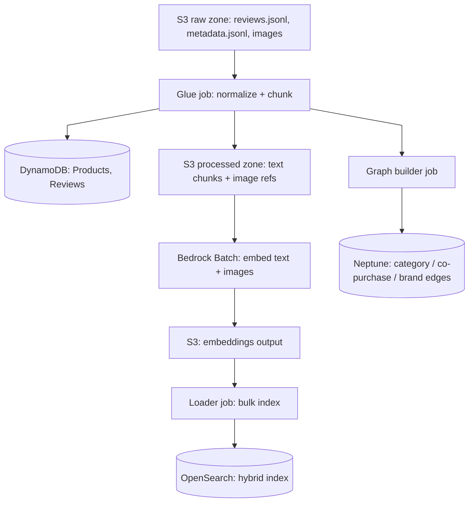

# 01 — Ingestion & Refresh Pipeline

## Overview

Loads the Amazon Reviews 2023 dataset (5,000 products, plus their reviews and images) from S3 into DynamoDB, OpenSearch, and Neptune, and supports periodic incremental refreshes on top of the initial load — not a single one-time import.

**Addresses**: FR4 (periodic data refresh), NFR-3 (scale: 5,000-product cap), NFR-4 (reliability/idempotency), NFR-1 (cost).

## Data flow

**Steps**:
1. Download the dataset into the S3 raw zone
2. Glue job normalizes raw records into product/review rows, writes them to DynamoDB, and produces chunked text ready for embedding in the S3 processed zone
3. Bedrock Batch job embeds all text chunks and images, writing vectors back to S3
4. Loader job bulk-indexes chunks + vectors + metadata into OpenSearch
5. Graph builder job derives edges from category hierarchy and "also bought / also viewed" fields, bulk-loads into Neptune

A Step Functions state machine sequences steps 2–5.

## Decisions & reasoning

### Chunking strategy

| Content | Approach | Why |
| --- | --- | --- |
| Product descriptions | Embed whole if under ~400 tokens; otherwise split by paragraph/bullet into ~200–400 token chunks, ~50-token overlap | Most descriptions are short enough to need no splitting at all |
| Reviews | One chunk per review in most cases; long reviews split by sentence groups at the same target | Reviews are typically short; splitting only when needed keeps chunk count down |
| Tags/attributes (brand, category, color, size) | Not chunked as free text — stored as structured metadata on every chunk (see OpenSearch filtering below); additionally rendered as one synthetic sentence per product (e.g. "Black leather wireless over-ear headphones by Sony") and embedded | Lets attribute-phrased semantic queries match, without treating structured facts as prose |
| Images | One embedding per image, no chunking; multiple images per product are separate documents linked by `product_id` | Images aren't decomposable the way text is |

Every chunk gets a deterministic id (`{product_id}#{chunk_index}`) carrying `product_id` as metadata, so any retrieved chunk traces back to its source product (and review id, for reviews).

### Embedding generation: Bedrock Batch for bulk, real-time for query

Bulk ingestion embeds hundreds to thousands of items with no latency requirement — Bedrock Batch is roughly half the cost of on-demand invocation and built for exactly this (submit a manifest in S3, get vectors back in S3, no throttling from a tight real-time loop). Query-time embedding of a single user query needs milliseconds, so it goes through the real-time endpoint instead — batch jobs are minutes-to-hours turnaround, unsuitable for an interactive request.

If the embedding model changes, re-run the batch job over the full corpus rather than patching individual vectors — this avoids two incompatible embedding spaces coexisting in the same index.

### Simulating refresh cadence

Rather than one bulk load, the dataset is split so the pipeline runs as a recurring process, the way it would in production:

- **Initial load**: full catalog + all reviews up to a cutoff date (the dataset carries real review timestamps, so this is a natural date split)
- **Delta batches**: reviews partitioned into monthly/weekly slices from the cutoff onward, each fed through the same pipeline as its own run

Each delta run exercises the pipeline as *updates*, not just inserts:
- DynamoDB: upsert by `product_id`
- OpenSearch: document upsert by chunk id — only the delta's chunks go through Bedrock Batch re-embedding, keeping re-embedding cost proportional to what changed
- Neptune: edge upserts (merge, not blind create), so replaying a delta batch never duplicates edges

**Trigger**: an EventBridge scheduled rule running once daily, invoking the Step Functions execution for the next delta partition — a live cadence rather than a manual one, so the system continuously demonstrates ingesting updates without someone kicking off each run.

This also gives a concrete staleness test: run two delta batches with a co-purchase signal that changes between them, and confirm the graph and search index both reflect the newer state.

### Idempotency

The dataset's ASIN is used as `product_id` everywhere (DynamoDB key, OpenSearch doc id, Neptune vertex id), so re-running any stage overwrites rather than duplicates.

## Open questions

- IaC tool for the Step Functions / Glue / Neptune bulk-loader setup (Terraform vs CDK) — not yet decided
- Whether the graph builder uses the Neptune Gremlin or openCypher bulk loader — pick based on which query language SearchAgent's counterpart, GraphAgent, ends up using (see [02](02-retrieval-agents.md))

## Status

Not started — see [../PROGRESS.md](../PROGRESS.md)
