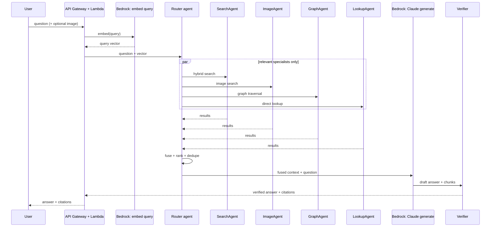

# 02 — Retrieval Agents & Query Orchestration

## Overview

At query time, a router agent decides which of four specialist retrieval agents apply to a given question, dispatches them in parallel, and fuses their results into context for answer generation.

**Addresses**: FR1 (natural-language product Q&A), FR2 (image-based query), FR5 (multi-source retrieval), NFR-2 (latency is not a constraint).

## When to use an agent vs. a direct LLM call

Use a **direct LLM call** (single prompt in, single completion out, no tool loop) when the sequence of steps is fixed and known in advance:
- Ingestion-time tagging/classification of a product or review
- Summarizing a long review before chunking
- Final answer generation: once context is retrieved and fused, one Claude call turns it into a grounded answer — this doesn't need to be agentic, it needs good context

Use an **agent** (a tool-calling loop where the model decides the next action from what it's seen so far) when the retrieval path itself isn't fixed — the model must decide, per query, which sources are relevant and whether one pass is enough:
- "Headphones under $50 with good bass" needs a structured filter (price) *and* semantic search (bass quality isn't a field)
- "What pairs well with this backpack" needs a graph hop (co-purchase edges), not just vector similarity
- Deciding whether the first retrieval round gave enough grounding, or whether to reformulate and retrieve again

## Architecture: multiple specialist agents, coordinated by a router

**Decision**: four retrieval agents, each scoped to one data source, dispatched by the router in parallel and only when relevant to the question — not a single agent juggling every tool itself.

1. **SearchAgent** — OpenSearch hybrid text search (BM25 + k-NN vectors) plus structured filters
2. **ImageAgent** — OpenSearch k-NN over image embeddings, for photo-based queries
3. **GraphAgent** — Neptune traversal (category hierarchy, co-purchase, brand)
4. **LookupAgent** — DynamoDB direct lookup by product/review id



### Why multi-agent, not single-agent-with-tools

A single agent calling four tools itself was the original default; two things favor specialist agents instead:
- **Latency isn't a constraint** here, so the usual downside of running agents in parallel and reconciling output — extra round-trip time — doesn't apply
- Each specialist stays small, independently testable, and easier to demo in isolation than one agent juggling four tools and their combined output itself

The router's job gets simpler, not harder: it only decides *which* specialists apply, not how to correctly call each data source.

**Tradeoff**: more agents means more Bedrock invocations per query (each dispatched specialist, plus the router, plus generator/verifier), raising cost per query versus the single-agent design. At this project's query volume the absolute impact is small, but it's tracked under the Bedrock metric (see [05](05-observability-cost.md)) rather than assumed free.

### Generator + verifier

After the router fuses context and Claude drafts an answer, a second, cheaper Claude call verifies each cited claim actually appears in the retrieved chunks before the answer returns. This targets "hallucinated confidence despite citations" (see [05](05-observability-cost.md)) and is cheap enough — one extra call, not a loop — to include from the start.

## OpenSearch metadata & filtering

Every indexed chunk carries structured fields alongside its vector, so filtering happens in the same query as the semantic search:

| Field | Type | Used for |
| --- | --- | --- |
| `product_id` | keyword | joins back to DynamoDB / citations |
| `category` / `category_path` | keyword | exact-match and hierarchy filtering |
| `brand` | keyword | exact-match filtering |
| `price` | float | range filtering ("under $50") |
| `avg_rating` | float | range filtering ("4 stars and up") |
| `review_count` | integer | popularity-based ranking/filtering |
| `chunk_type` | keyword | description / review / tag-summary / image |
| `in_stock` | boolean | excludes unavailable items, if the dataset carries availability |

These fields go in the `filter` clause of a `bool` query (not `must`), alongside the `knn`/`match` clauses — filter context isn't scored and OpenSearch caches it, so more filter fields don't slow the semantic part down. This is what lets SearchAgent combine "under $50" with "good bass" in one round trip.

## Answer format

The API returns structured JSON, not a single prose string:

```json
{
  "answer": "...",
  "citations": [
    {"product_id": "...", "title": "...", "image_url": "https://cdn.example/....jpg", "product_url": "/products/...", "snippet": "..."}
  ]
}
```

Claude can't generate images, so it never inlines one — it cites a `product_id`. The API resolves each cited id to an `image_url` (CloudFront-fronted S3 key, already available from ingestion) and a `product_url` before returning, so the frontend renders a product card — thumbnail plus link — per citation. URL resolution stays a deterministic post-processing step outside the model.

## When multi-agent would go further

If the system grew genuinely different task types (comparison shopping vs. troubleshooting vs. recommendation) with different success criteria, separate top-level agents per task type — not just per data source — would earn their complexity. Not building that upfront.

## Status

Not started — see [../PROGRESS.md](../PROGRESS.md)
