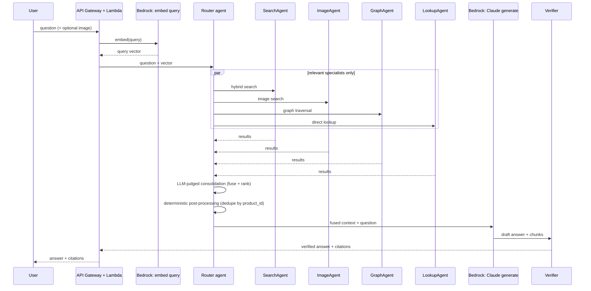

# 02 — Retrieval Agents & Query Orchestration

## Overview

At query time, a router agent decides which of four specialist retrieval agents apply to a given question, dispatches them in parallel, and fuses their results into context for answer generation.

**Addresses**: FR1 (natural-language product Q&A), FR2 (image-based query), FR5 (multi-source retrieval), NFR-2 (latency is not a constraint).

## When to use an agent vs. a direct LLM call

Use a **direct LLM call** (single prompt in, single completion out, no tool loop) when the sequence of steps is fixed and known in advance:
- Ingestion-time tagging/classification of a product or review
- Summarizing a long review before chunking
- Final answer generation: once context is retrieved and fused, one Claude call turns it into a grounded answer — this doesn't need to be agentic, it needs good context

Use an **agent** (a tool-calling loop where the model decides the next action from what it's seen so far) when the retrieval path itself isn't fixed — the model must decide, per query, which sources are relevant and whether one pass is enough:
- "Headphones under $50 with good bass" needs a structured filter (price) *and* semantic search (bass quality isn't a field)
- "What pairs well with this backpack" needs a graph hop (co-purchase edges), not just vector similarity
- Deciding whether the first retrieval round gave enough grounding, or whether to reformulate and retrieve again

## Architecture: multiple specialist agents, coordinated by a router

**Decision**: four retrieval agents, each scoped to one data source, dispatched by the router in parallel and only when relevant to the question — not a single agent juggling every tool itself.

1. **SearchAgent** — OpenSearch hybrid text search (BM25 + k-NN vectors) plus structured filters
2. **ImageAgent** — OpenSearch k-NN over image embeddings (`product_images` index, Cohere Embed v4, 1536-dim — see [01](01-ingestion-pipeline.md#image-embeddings-cohere-embed-v4-one-per-product) for why Titan Multimodal wasn't available), for photo-based queries
3. **GraphAgent** — traversal over the DynamoDB adjacency-list graph (category hierarchy, co-purchase, brand); not Neptune — this AWS account's plan doesn't support it (see [01](01-ingestion-pipeline.md#graph-storage-dynamodb-not-neptune))
4. **LookupAgent** — DynamoDB direct lookup by product/review id



### Why multi-agent, not single-agent-with-tools

A single agent calling four tools itself was the original default; two things favor specialist agents instead:
- **Latency isn't a constraint** here, so the usual downside of running agents in parallel and reconciling output — extra round-trip time — doesn't apply
- Each specialist stays small, independently testable, and easier to demo in isolation than one agent juggling four tools and their combined output itself

The router's job gets simpler, not harder: it only decides *which* specialists apply, not how to correctly call each data source.

**Tradeoff**: more agents means more Bedrock invocations per query (each dispatched specialist, plus the router, plus generator/verifier), raising cost per query versus the single-agent design. At this project's query volume the absolute impact is small, but it's tracked under the Bedrock metric (see [05](05-observability-cost.md)) rather than assumed free.

### Agent implementation: hand-rolled Claude tool-use loop on Bedrock AgentCore Runtime

**Originally planned: AWS Bedrock Agents, multi-agent collaboration** (`--agent-collaboration`, `associate-agent-collaborator`) — the router as supervisor agent, each specialist as a collaborator agent with its own Lambda-backed action group. `create-agent --agent-collaboration` and `associate-agent-collaborator --help` both existed in the CLI, which was (wrongly) treated as availability confirmation.

**Reversed after a real deploy attempt.** `cdk deploy` failed on the first `CfnAgent` resource with a generic `AccessDenied`; a direct, minimal `aws bedrock-agent create-agent` call (bypassing CloudFormation, to isolate the cause) surfaced the real reason: `AccessDeniedException: Bedrock Agents is in Maintenance Mode. New agent creation is not available for accounts without prior service usage.` A CLI subcommand existing in the SDK's local schema does not mean the service will accept the call — this account has zero prior Agents usage, so classic Bedrock Agents (including multi-agent collaboration) is closed to it entirely, not an IAM permissions problem. Lesson generalized into [CLAUDE.md](../../CLAUDE.md).

**Considered next: Bedrock AgentCore** (the newer `bedrock-agentcore`/`bedrock-agentcore-control` service) as a like-for-like replacement. Confirmed reachable on this account (`list-agent-runtimes` succeeds). But AgentCore is a fundamentally different thing than classic Agents: it's a hosting platform for arbitrary agent code (plus a large adjacent surface — gateways, memory, workload identity, browser tools, payment connectors — built for much bigger agent platforms), not a declarative "supervisor decides which collaborator to call" orchestrator. The router-dispatch logic has to be hand-written code either way; AgentCore doesn't remove that work, it just changes where the code runs.

**Decision: hand-rolled Claude tool-use loop, hosted on AgentCore Runtime.** Each agent is a small Python program using Bedrock's **Converse API** (not raw Anthropic `invoke_model` JSON — Converse's `toolConfig`/`toolUse`/`toolResult` shape is provider-agnostic and simpler to hand-roll a loop around) to decide which tool to call, executes that tool in-process, and loops until the model returns a final answer instead of another tool call. This is the "hand-rolled Lambda tool-loop" alternative from the original design, just deployed on AgentCore Runtime rather than Lambda, per an explicit choice to use AgentCore over plain Lambda despite the added complexity (Docker/ECR build instead of a zip, a larger SDK surface) — chosen deliberately, not because it was technically necessary.

**Deployment mechanics** (per agent): a `Dockerfile` (`infra/agent_runtimes/<agent>/`) built via CDK's `AgentRuntimeArtifact.from_asset` (same "let CDK own build+publish" pattern as the Glue script/module assets), `platform=LINUX_ARM64` (AgentCore Runtime's required architecture), running the `bedrock_agentcore` Python SDK's `BedrockAgentCoreApp` (`@app.entrypoint`, listens on port 8080 — the SDK provides this HTTP contract, not hand-written). The `bedrockagentcore.Runtime` L2 CDK construct auto-generates a correctly-scoped execution role (trust principal `bedrock-agentcore.amazonaws.com`, `SourceAccount`/`SourceArn` conditions) with baseline logging/tracing permissions; app-specific permissions (`bedrock:InvokeModel`, DynamoDB read) are added on top via `add_to_role_policy`/`grant_read_data`.

**Foundation models**: specialists and the router's own routing/consolidation calls use `us.anthropic.claude-haiku-4-5-20251001-v1:0` (cheap/fast, matches the ingestion-time model choice) — `us.anthropic.claude-sonnet-5` specifically returned `AccessDeniedException` on this account (see [Experiment 02](../experiments/02-summarization-prompting.md)), so where a stronger model actually is used, it's sonnet-4-5, not sonnet-5. **Corrected while implementing the generator/verifier** (an earlier draft of this doc said both would use sonnet-4-5): the generator uses `us.anthropic.claude-sonnet-4-5-20250929-v1:0` (stronger model for the user-facing answer), but the **verifier uses Haiku, not Sonnet** — matching the "Generator + verifier" section's own original reasoning below ("a second, *cheaper* Claude call verifies..."), which the earlier blanket statement had drifted from before any of this was actually built.

**Shared tool-loop contract** (`src/agents/tool_loop.py`, factored out once SearchAgent needed the identical shape as LookupAgent): `run_tool_loop(bedrock, model_id, instruction, tools, run_tool, user_message, max_turns)` calls Claude, executes any requested tool(s), and either loops again (so an agent can reformulate and retry — e.g. broaden a search that returned too little, per the design's own reasoning for using an agent loop at all) or returns once Claude stops requesting tools. Returns `{"results": [...], "message": str|None}` — **`results` is structured data (the router's fuse/rank/dedupe input), not prose**; this was corrected after initially building LookupAgent to return a paraphrased final answer, which doesn't match the design's own sequence diagram (`SRCH-->>RTR: results`, not `SRCH-->>RTR: answer` — the router calls a separate generator for the user-facing answer). `message` carries Claude's own text when it declines a request or has nothing further to add — informative, but never the primary payload.

A tool may return one record (`dict`, e.g. LookupAgent) or several (`list[dict]`, e.g. SearchAgent) — both flatten into the same `results` list. One real API constraint surfaced building this: Bedrock Converse's `toolResult.content[0].json` must be a JSON *object*, not a bare array (`ValidationException` otherwise) — a `list` result is wrapped as `{"items": [...]}` before being sent back to Claude, while `results` at the agent's own response level stays a flat, unwrapped list.

#### LookupAgent — built first, as the pattern-proving agent

Simplest of the four (exact-id retrieval only, no ranking/ambiguity), built first to prove the Dockerfile/CDK/IAM/AgentCore wiring before the harder agents. Deployed and verified for real (see [PROGRESS.md](../PROGRESS.md)).

- **Tools**: `get_product(product_id)`, `get_review(product_id, review_id)` — both DynamoDB `get_item` calls, no search. `get_review` requires both ids (the `Reviews` table's key is the composite `(product_id, review_id)`; every review id this system ever surfaces already carries its `product_id` alongside it via a chunk citation, so this isn't an artificial constraint).
- **Instruction (system prompt)**, verbatim from `infra/stacks/agents_stack.py` / `src/agents/lookup_agent_runtime.py`:
  > You are LookupAgent, a specialist in a multi-agent product Q&A system for an e-commerce catalog. Your only job is direct, exact retrieval of one specific product or review record when given its id - you do not search, filter, rank, or guess.
  >
  > Rules:
  > - If asked for a product, call get_product with the exact product_id given. Return its fields as-is.
  > - If asked for a review, call get_review with both the product_id and review_id given - reviews cannot be looked up by review_id alone, both ids are required.
  > - If no id is given, or the id doesn't exist in the system, say so plainly. Never invent or substitute a different id, and never guess at values you weren't given.
  > - You have no other capabilities - if the request isn't a direct id lookup, say this agent only handles direct id lookups.

  Reasoning: explicit negative constraints ("you do not search, filter, rank, or guess") exist because a generically-helpful Claude would otherwise try to be useful beyond this agent's actual scope (e.g. attempt to recommend a product when asked "what's the best moisturizer" instead of declining) — verified this actually matters, see below.
- **`MAX_TURNS = 4`**: caps the tool-call loop so a pathological case (model keeps calling tools without ever settling on an answer) can't hang indefinitely. Not tuned by experiment — 4 is comfortably above the 1-2 turns this agent's task actually needs (one tool call, one final answer), so it's a safety ceiling, not a real constraint in practice.
- **No temperature/top_p override**: Converse's default sampling settings were left as-is. LookupAgent's task has no creative ambiguity to tune around (a given id either maps to one record or it doesn't), so there was nothing to justify adding `promptOverrideConfiguration`-equivalent complexity for.
- **No experiment run**: unlike the chunking/prompting/indexing decisions, this agent's correctness isn't a "which setting scores higher" question — it's binary (did it call the right tool with the right id, or not) and was checked directly against three real cases instead (see below), not through a scored comparison.

**Verification, against the real deployed runtime** (not a mock): three real `invoke-agent-runtime` calls —
1. Valid id (`B01CUPMQZE`) → `results` correctly contained the full product record (price legitimately `$0.00` — the dataset's own missing-price default, see `dataset_source.parse_product`; Claude's `message` even flagged this as likely-missing data unprompted, before the results-vs-message contract was corrected)
2. Nonexistent id (`NOTAREALID123`) → empty `results`, `message` reported not found, no hallucinated substitute
3. Out-of-scope request ("What is the best moisturizer under $20?") → empty `results`, `message` declined and explained its actual scope, did not attempt to search/recommend

All three passed as designed — confirming the explicit negative-constraint instruction wording (test case 3) actually does its job, not just that the tool-calling mechanics work (test cases 1-2).

#### SearchAgent — hybrid search over `chunks`, with structured filters

- **Tool**: `search_products(query_text, category?, brand?, min_price?, max_price?, min_rating?, in_stock?)` — one hybrid query (see "Indexing strategy" above for the fusion method) against the `chunks` index, filters applied identically to both the BM25 and k-NN sub-queries via `bool.filter` (verified empirically that OpenSearch's native `hybrid` query accepts per-clause filters this way before building around it).
- **Instruction (system prompt)**, verbatim from `src/agents/search_agent_runtime.py`:
  > You are SearchAgent, a specialist in a multi-agent product Q&A system for an e-commerce catalog. Your job is to translate a shopper's question into a search over product descriptions, reviews, and tags - extracting any structured constraints so they're applied as real filters instead of left as text for the search to guess at.
  >
  > Rules:
  > - Call search_products with:
  >   - query_text: the semantic/descriptive part of the question (what the product should be, do, or feel like) - features, use case, qualities like "good bass" or "gentle on skin". Do not put a fact into query_text if a specific filter field exists for it.
  >   - category / brand: only when the shopper names one explicitly and exactly - never guess one from context.
  >   - min_price / max_price: from phrases like "under $50", "between $20 and $40", "at least $10".
  >   - min_rating: from phrases like "4 stars and up", "highly rated".
  >   - in_stock: true only when the shopper explicitly asks for in-stock items.
  > - If the first search returns few or no relevant-looking results, you may try again once with a broader query_text or relaxed filters before giving up - do not loop indefinitely.
  > - You have no other capabilities - if the request isn't a product search, say so.

  Reasoning: the instruction explicitly tells Claude *which facts belong in filters vs. free text* ("do not put a fact into query_text if a specific filter field exists for it") because leaving that ambiguous risks a price constraint silently becoming unenforced search text instead of a real `range` filter — the failure mode the whole design's filtering section exists to avoid.
- **Query embedding happens inside the tool, not before it**: `run_tool` embeds `query_text` via Titan (real-time, same model as ingestion) only once Claude has decided what that text should be — keeping SearchAgent self-contained and independently testable, at the cost of one embedding call per search rather than the router pre-embedding once for every dispatched specialist (a later optimization once the router exists, not needed now).
- **`MAX_TURNS = 4`**, no temperature override — same reasoning as LookupAgent, except here the reformulate-and-retry allowance in the instruction actually uses the multi-turn budget (LookupAgent's task never needs a second turn; SearchAgent's can).
- **No naive fusion**: uses the native `hybrid` query + normalization pipeline from [Experiment 05](../experiments/05-searchagent-fusion-method.md), not the rejected naive sum from Experiment 04.

**Real gotchas hit deploying this one** (both now in [CLAUDE.md](../../CLAUDE.md)): the OpenSearch domain's account-wide resource policy alone wasn't enough to authorize the runtime's role — a real `403` (`no identity-based policy allows the es:ESHttpPut action`) required an explicit `grant_read_write` (not just `grant_read`) on the role, since the search-pipeline setup is a `PUT`; and Converse's `toolResult.content[0].json` rejected a bare list (a real `ValidationException`), fixed by the `{"items": [...]}` wrapping described above.

**Verification, against the real deployed runtime**: three real `invoke-agent-runtime` calls —
1. "gentle moisturizer for sensitive skin under $15" → 5 relevant results, all at or under $15 (or the dataset's `$0.00` missing-price marker), correctly combining the semantic query with a real `max_price` filter
2. "anything from the brand Acme" (a brand that doesn't exist in this catalog) → 0 results, message correctly reported nothing found rather than fabricating a match
3. "headphones with good bass" (this dataset is All_Beauty only — no audio equipment exists in it) → results came back (lexical noise on "headband"/"headphone" tag text), but Claude's own `message` correctly recognized and flagged that the retrieved items *weren't actually relevant* rather than presenting noise as a real answer

Case 3 is the more interesting result: it shows the agent's own judgment catching a retrieval failure the tool itself couldn't detect (the tool has no relevance threshold — it returns whatever scores highest, even when the honest answer is "nothing here is a good match").

#### GraphAgent — DynamoDB adjacency-list traversal

- **Tool**: `find_related_products(product_id, relation)` where `relation` is exactly one of `co_reviewed`, `same_brand`, `same_category` — three separate relation types, not a general "traverse the graph" tool, because each maps to a different real question ("what pairs with this" vs. "what else does this brand make" vs. "what's in the same category") and a general tool would push the choice of *how many hops* onto Claude instead of encoding it in code, where it's actually deterministic.
  - `co_reviewed` is a **1-hop** query: `CO_REVIEWED_WITH` edges are already product-to-product (written both directions at ingestion time), so one `Query` on `product#{id}` filtered to that edge-type prefix is enough.
  - `same_brand`/`same_category` are **2-hop**: first `Query` the product's own node for its `HAS_BRAND`/`BELONGS_TO` edge to find *which* brand/category node it belongs to, then `Query` *that* node for `HAS_PRODUCT` edges to find its siblings, excluding the original product. Both hops are single-partition queries — the adjacency-list schema's whole point (see [01](01-ingestion-pipeline.md#graph-storage-dynamodb-not-neptune)).
- **Instruction (system prompt)**, verbatim from `src/agents/graph_agent_runtime.py`:
  > You are GraphAgent, a specialist in a multi-agent product Q&A system for an e-commerce catalog. Your job is to find products connected to a given product through the catalog's relationship graph - not by searching text.
  >
  > Rules:
  > - Call find_related_products with the product_id and exactly one relation:
  >   - "co_reviewed": products that people who reviewed this product also reviewed - the closest signal this catalog has to "customers who bought this also liked", useful for "what pairs well with this" or "what else would go with this" questions.
  >   - "same_brand": other products from the same brand.
  >   - "same_category": other products in the same category.
  > - Pick the relation that matches what the shopper is actually asking - do not call all three "just in case" or guess a relation from vague wording.
  > - You only work from a product_id you already have - if the shopper hasn't given or implied a specific product, say you need one to traverse from.
  > - You have no other capabilities - if the request isn't about finding related products, say so.

  Reasoning: "do not call all three 'just in case'" exists because a generically-helpful Claude would otherwise hedge by calling every relation and dumping all three result sets — plausible-sounding but wasteful (3x the DynamoDB queries for a question that implies one specific relation) and worse for the router's consolidation step (more noise to fuse/rank than the question actually calls for). The `co_reviewed` description spells out *when* to use it (explicitly names the "what pairs with this" phrasing from the design's own motivating example) since that relation's real-world meaning isn't obvious from its edge-type name alone.
- **`MAX_TURNS = 4`**, no temperature override, no experiment — same reasoning as LookupAgent: the task is deterministic given a valid `(product_id, relation)` pair, nothing to tune.

**No new gotchas** — first agent so far to deploy and work correctly on the first real attempt, likely because it reuses the exact `tool_loop.py`/`AgentsStack._build_runtime` pattern both prior agents already found and fixed the rough edges of.

**Verification, against the real deployed runtime**, using real edges from `build_graph_edges.py`'s actual output (not synthetic test data):
1. "What other products does the same brand as product B01A5YXRX2 make?" → correctly returned the other 2 products under `brand#Plant Therapy` (a real 3-product brand in the loaded catalog), excluding the queried product itself
2. "What pairs well with product B091DJ6ZXR?" → correctly returned its one real `CO_REVIEWED_WITH` sibling (`B08GKHNQKJ`) from the actual sparse 448-edge co-reviewed graph
3. "What products are generally popular?" (no specific product given) → empty `results`, message correctly explained it needs a starting product rather than guessing one

#### ImageAgent — k-NN over `product_images`, from an uploaded photo

The first genuinely multimodal agent — the query is an image, not text, which changes the shape of the loop itself, not just the prompt:

- **`run_tool_loop` generalized to accept multimodal content**, not just a plain-text `user_message`: `src/agents/tool_loop.py` now takes `str | list[dict]`, so an agent can hand it a pre-built Converse content list (`[{"image": {...}}, {"text": ...}]`) instead of plain text. Verified Claude Haiku 4.5 actually accepts image input via Converse with a real call against a real product image before building around it (it correctly identified the product from the photo).
- **The image is embedded *before* the loop starts, not lazily inside the tool call** (unlike SearchAgent, which embeds only after Claude has extracted a query from the text). There's no extraction step for a photo — the image already *is* the complete query, so there's nothing to wait on Claude to decide first; embedding eagerly avoids a wasted round-trip.
- **`run_tool` is a closure built fresh per request** (`invoke()`), not a fixed module-level function like every other agent's — it needs that specific request's embedding, which Claude never sees or echoes back through a tool call's arguments (tool arguments only ever carry what Claude explicitly outputs, and raw image bytes have no reason to round-trip through that).
- **Tool**: `find_visually_similar_products(category?, brand?, min_price?, max_price?, min_rating?, in_stock?)` — pure k-NN (see `src/agents/image_tools.py`), no hybrid/text component, since there's no text signal for a photo the way SearchAgent has review/description text to match against. Filter-building logic (`src/agents/search_filters.py`) is shared with SearchAgent rather than duplicated — both filter the same product-level fields.
- **Instruction (system prompt)**, verbatim from `src/agents/image_agent_runtime.py`:
  > You are ImageAgent, a specialist in a multi-agent product Q&A system for an e-commerce catalog. A shopper has uploaded a photo - your job is to find visually similar products, optionally narrowed by any structured constraints mentioned in their accompanying text.
  >
  > Rules:
  > - Call find_visually_similar_products with any filters mentioned in the shopper's text:
  >   - category / brand: only when named explicitly and exactly - never guess one from what the image looks like.
  >   - min_price / max_price: from phrases like "under $50", "between $20 and $40", "at least $10".
  >   - min_rating: from phrases like "4 stars and up", "highly rated".
  >   - in_stock: true only when explicitly asked for in-stock items.
  > - If no text accompanies the image, or it mentions no constraints, call the tool with no filters - the image itself is the whole query.
  > - You have no other capabilities - if the request isn't about finding visually similar products, say so.

  Reasoning: "never guess [category/brand] from what the image looks like" mirrors SearchAgent's equivalent instruction — the risk is the same (an unenforced guess masquerading as a real filter), just triggered by a different input (Claude speculating from pixels instead of vague text) rather than a new failure mode.
- **`MAX_TURNS = 4`**, no temperature override, no experiment — consistent with the other three agents' reasoning: nothing here is a tunable judgment call once the embedding exists.

**Real gotcha hit deploying this one** (now in [CLAUDE.md](../../CLAUDE.md), and it generalizes SearchAgent's earlier PUT-specific finding): `grant_read` doesn't even cover an ordinary `_search` query — a real `403` (`no identity-based policy allows the es:ESHttpPost action`) showed that opensearch-py sends a `_search` with a request body as a **POST**, not a GET, so `grant_read` alone can't run a plain query, only `grant_read_write` actually works in practice. Both SearchAgent's and ImageAgent's runtime roles now use `grant_read_write`.

**Verification, against the real deployed runtime**, using a real product image (not a synthetic test fixture):
1. Downloaded a real indexed product's own image and sent it back as the query, no text filters — top result was that exact product (self-match), followed by 4 other real, visually similar items (the same "silicone back-scrubber" style product from different brands); Claude's own message correctly described what was in the photo, unprompted
2. Same image, with "only from the brand kapoua" in the accompanying text → correctly narrowed to just the one visually-similar match that's also from that brand, confirming image similarity and text-derived filters compose correctly

### Consolidating specialist results: LLM-judged, then deterministically deduped

**Decision**: the router's supervisor Claude call reads all four specialists' raw results directly and judges relevance/ranking itself — not a numeric formula. The four sources aren't comparable on a shared scale (an OpenSearch relevance score, a k-NN similarity score, a graph "connected via brand" edge with no score at all, and a direct lookup with no ranking involved) — the same kind of apples-to-oranges problem that made naive score-summing fail for text-vs-image hybrid search (see [Experiment 04](../experiments/04-indexing-strategy.md)). Rather than inventing another formula to weight four incompatible signal types, the router's own model reasoning does the judgment call, the same way it already decides *which* specialists to dispatch.

**But deduplication is a separate, deterministic post-processing step, not left to the LLM.** The same product can legitimately surface from more than one specialist (e.g. SearchAgent finds it by description match, GraphAgent finds it as a same-brand neighbor) — catching and collapsing that is an exact-match check on `product_id`, not a judgment call, and LLMs are not reliable at exhaustively deduplicating a list by exact key across a longer context. This follows the same "direct/deterministic for mechanical work, LLM only for actual judgment" split already used elsewhere in this design (e.g. `chunk_review` summarizes via Claude but chunks deterministically) — consolidation and deduplication are different kinds of task, so they get different mechanisms rather than asking one LLM call to do both reliably.

**Validated** — see the Router section immediately below for the implementation and real verification results.

### Router — dispatch, parallel invocation, and consolidation

Built last, once all four specialists existed to dispatch to. Unlike the specialists, **the router doesn't use `tool_loop.py`'s Claude-tool-use loop.** Its shape is two distinct phases — a routing decision, then a separate consolidation decision — not one open-ended "call a tool, see the result, maybe call another" loop, and forcing both phases through Converse tool-use would interleave "which specialists ran" and "the final judged ranking" into the same flat tool-call history instead of keeping them as two clearly separate outputs. Instead, `src/agents/router_runtime.py` makes two focused, single-turn, JSON-output Claude calls:

1. **Routing decision** — one Claude call classifies the question against all four specialists at once (`{"search_agent": bool, "graph_agent": bool, "lookup_agent": bool, "image_agent": bool}`), instructed to select only what actually applies, not every specialist "just in case" (the same anti-hedging instruction pattern already used in GraphAgent's prompt). `image_agent` is force-set to `false` in code whenever no image was actually provided, regardless of what Claude decided — a deterministic guard against dispatching a specialist with nothing to search with.
2. **Parallel dispatch** — every specialist Claude selected is invoked concurrently via a `ThreadPoolExecutor` calling `bedrock-agentcore:InvokeAgentRuntime` on each one's real ARN, genuinely parallel HTTP calls rather than relying on however Converse happens to batch tool_use blocks in one turn. Each specialist's own `results` (raw, undeduped) are collected into one candidate pool.
3. **Consolidation** — a second Claude call is shown the original question plus every candidate (JSON-dumped, no numeric score field to lean on) and asked to return only `{"ranked_product_ids": [...]}`, in relevance order, omitting anything not actually relevant — the LLM-judged half of the consolidation decision above.
4. **Deterministic dedupe + reattach** (`dedupe_and_rank` in `src/agents/router_tools.py`) — plain Python, not a model call: keeps one record per `product_id` (whichever candidate was seen first — different specialists return different field shapes for the same product, e.g. a full record from LookupAgent vs. a chunk snippet from SearchAgent, and this doesn't attempt to merge them; a known simplification, worth revisiting once the generator's actual field needs are known), ordered by Claude's ranking, silently dropping any id Claude didn't include.

**Real API detail confirmed before building around it**: `bedrock-agentcore:InvokeAgentRuntime`'s response carries the payload as a `StreamingBody` under `response["response"]`; `.read()` gives the same raw JSON each specialist already returns. Also confirmed `runtimeSessionId`'s real length constraint (33-256 chars) via the CLI help rather than guessing, since a too-short generated id would fail silently different from every other error seen so far.

**No new gotchas** deploying this one — clean synth, clean deploy, all three real verification calls passed without a fix cycle, the first agent in this workflow to do so start-to-finish.

**Verification, against the real deployed runtime**:
1. "gentle moisturizer for sensitive skin under $15" → routed to `search_agent` only, correctly; consolidation trimmed SearchAgent's 5 raw candidates down to 4, judged as the actually-relevant ones
2. "Tell me about product B01A5YXRX2, and what other products does the same brand make?" → routed to **both** `graph_agent` and `lookup_agent`, dispatched in parallel; consolidated result correctly combined LookupAgent's full record for the named product with GraphAgent's two real same-brand siblings (the same `Plant Therapy` pair verified directly in GraphAgent's own testing) — no duplicates, sensible order
3. "What is your return policy?" (genuinely out of scope for all four specialists) → `dispatched: []`, empty `citations`, and the routing call correctly recognized nothing applies rather than forcing a dispatch

Case 2 is the one that actually exercises the router's reason for existing: a real question needing two different specialists, dispatched together, correctly fused into one deduplicated answer.

### Generator + verifier

After the router's consolidation produces the final deduped, ranked `results`, it hands off internally to two more direct LLM calls (`src/agents/answer_generation.py`) — matching the sequence diagram's `RTR->>GEN->>VER`. These aren't a separate AgentCore Runtime: the design's own "When to use an agent vs. a direct LLM call" reasoning already says final answer generation "doesn't need to be agentic, it needs good context," and the router already has the context assembled.

**Generator** (`generate_answer`, Sonnet 4.5): given the question and the consolidated records, produces `{"answer": "...", "citations": [{"product_id": "...", "snippet": "..."}]}`. Instructed explicitly not to cite a product just because it's present in the records — only when there's a real, specific claim it supports — which is what made the real verification run correctly *omit* citations for the two `GraphAgent`-sourced products that had no actual text content to quote (see case 2 below), rather than fabricating a snippet for them.

**Verifier** (`verify_citations`, **Haiku, not Sonnet**): shown each citation next to its actual source record, and asked for a strict `{"verdicts": [{"product_id": "...", "grounded": bool}]}` — a claim can be plausible-sounding without actually being supported by the record it's attributed to, which is exactly the "hallucinated confidence despite citations" failure mode this targets (see [05](05-observability-cost.md)). Ungrounded citations are dropped in code, not left in with a warning — deterministic, not another judgment call. Using Haiku here (not Sonnet, despite an earlier draft of this doc saying both would be Sonnet — corrected once actually building this) matches the *original* reasoning for this step: verifying a claim is grounded is a strictly easier task than drafting the answer, so it doesn't need the stronger, pricier model.

**Citation resolution** (`resolve_citations`, plain code, no model call): the design's Answer Format spec requires `title`/`image_url`/`product_url` per citation, resolved deterministically via a DynamoDB lookup, not by asking the model (which can't see images and shouldn't be trusted to remember exact titles/URLs). `product_url` is a placeholder path (`/products/{id}`) — workflow 06 (Frontend Hosting) doesn't exist yet, so there's nowhere real to link to; flagged rather than silently treated as a working link.

**Citations are not deduped by `product_id` the way `results` is** — a real, intentional difference: `results` dedup collapses the same *product* into one record, but a citation represents one *claim*, and a single product can legitimately support several distinct claims with different snippets (confirmed in the real run below — a product with a rich description was cited four times, once per distinct fact quoted from it). Collapsing those would lose the claim-to-snippet mapping the verifier just checked.

**Verification, against the real deployed router+generator+verifier pipeline**:
1. "Tell me about product B01A5YXRX2, and what other products does the same brand make?" → the generator correctly produced 4 grounded citations for the named product (one per distinct fact: ingredients, quality claim, usage, rating), each with a real quoted snippet, resolved to its real title/image/placeholder URL — and correctly **declined** to cite the two same-brand sibling products at all, since GraphAgent's records for them carried no actual text content to ground a claim in; the answer's prose still mentioned them by id, honestly noting "specific details... are not available" rather than inventing any
2. "gentle moisturizer for sensitive skin under $15" (search-only) → a real answer citing 2 of the retrieved reviews with real quoted snippets, correct price constraint respected in the products named
3. "What is your return policy?" (out of scope) → `{"answer": "I couldn't determine which part of the catalog applies to this question.", "citations": [], "dispatched": []}` — the same early-return path as before, now shaped to match the unified Answer Format contract instead of the earlier `results`/`message` shape

This completes workflow 02's core request pipeline end-to-end: routing → parallel dispatch → LLM-judged consolidation → deterministic dedupe → generation → verification → citation resolution, all real, all deployed, all verified against live AWS calls rather than mocks.

## OpenSearch metadata & filtering

Every indexed chunk carries structured fields alongside its vector, so filtering happens in the same query as the semantic search:

| Field | Type | Used for |
| --- | --- | --- |
| `product_id` | keyword | joins back to DynamoDB / citations |
| `category` / `category_path` | keyword | exact-match and hierarchy filtering |
| `brand` | keyword | exact-match filtering |
| `price` | float | range filtering ("under $50") |
| `avg_rating` | float | range filtering ("4 stars and up") |
| `review_count` | integer | popularity-based ranking/filtering |
| `chunk_type` | keyword | description / review / tag-summary / image |
| `in_stock` | boolean | excludes unavailable items, if the dataset carries availability |

These fields go in the `filter` clause of a `bool` query (not `must`), alongside the `knn`/`match` clauses — filter context isn't scored and OpenSearch caches it, so more filter fields don't slow the semantic part down. This is what lets SearchAgent combine "under $50" with "good bass" in one round trip.

## Indexing strategy

**ANN engine: `lucene`, not `nmslib`/`faiss`.** OpenSearch's k-NN plugin supports three engines for the HNSW vector index; `lucene` is native to OpenSearch itself, with no separate native library to install/manage — `nmslib` and `faiss` exist mainly for the recall/speed tuning that matters at millions of vectors. At this dataset's scale (5,000 products, roughly 15k chunks), that tradeoff isn't real — exact k-NN would perform fine here too — so there was nothing to benchmark, just an ops-simplicity call consistent with the smallest-footprint stance elsewhere in this design. See `src/ingestion/opensearch_documents.py`.

**Similarity metric: cosine (`cosinesimil`)**, matching how embedding similarity is conventionally compared; revisit only if Titan's embedding documentation turns out to recommend dot product on pre-normalized vectors instead.

**Two indexing decisions genuinely worth deciding deliberately:**

- **Hybrid combination method — resolved by experiment, see [Experiment 04](../experiments/04-indexing-strategy.md) and [Experiment 05](../experiments/05-searchagent-fusion-method.md).** A naive `bool(knn, match)` combination (OpenSearch's default summed scoring) was tested against real retrieval and rejected: BM25 scores (single digits to 20+, unbounded) dominate the bounded cosine-similarity scores (0.6-0.7) in the sum, so the "hybrid" query silently degrades to text-only search whenever both clauses fire. **SearchAgent uses OpenSearch's native `hybrid` query with a `min_max` normalization search pipeline, equal-weighted (0.5/0.5)** — tested against weighted RRF (which underperformed) and plain BM25/kNN; see Experiment 05 for why native hybrid was still chosen despite not clearly beating BM25 in that eval (a real, identified blind spot in the synthetic query methodology, not a rejection of hybrid search itself).
- **Chunk granularity ("small-to-big")**: still open, deferred to when SearchAgent is actually implemented (not yet — see [PROGRESS.md](../PROGRESS.md)). Right now a retrieved chunk *is* what gets passed to the generator. A common alternative is indexing small, precise chunks for matching but expanding to a larger context window (the full review, or neighboring chunks) before generation — a chunk can match a query well while being too narrow to actually answer from. Unlike the combination method, this can't be validated with retrieval-only metrics; it needs an answer-generation step with citations (see [Experiment 04](../experiments/04-indexing-strategy.md#still-open)).

## Answer format

The API returns structured JSON, not a single prose string:

```json
{
  "answer": "...",
  "citations": [
    {"product_id": "...", "title": "...", "image_url": "https://cdn.example/....jpg", "product_url": "/products/...", "snippet": "..."}
  ]
}
```

Claude can't generate images, so it never inlines one — it cites a `product_id`. The API resolves each cited id to an `image_url` (CloudFront-fronted S3 key, already available from ingestion) and a `product_url` before returning, so the frontend renders a product card — thumbnail plus link — per citation. URL resolution stays a deterministic post-processing step outside the model.

## When multi-agent would go further

If the system grew genuinely different task types (comparison shopping vs. troubleshooting vs. recommendation) with different success criteria, separate top-level agents per task type — not just per data source — would earn their complexity. Not building that upfront.

## Status

Core pipeline complete and deployed for real: all four specialist agents (LookupAgent, SearchAgent, GraphAgent, ImageAgent), the router (routing → parallel dispatch → LLM-judged consolidation → deterministic dedupe), and the generator + verifier (grounded answer generation, citation verification, citation resolution) — see [../PROGRESS.md](../PROGRESS.md) for what's built and how each piece was verified against real AWS calls.
