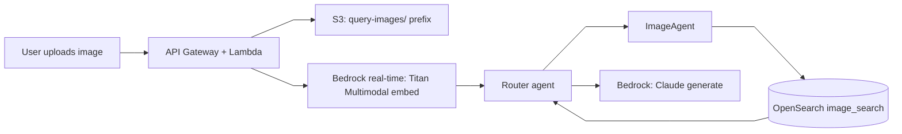

# 03 — Image Upload & Multimodal Query

## Overview

A user can upload a photo ("find products like this") instead of, or alongside, typed text.

**Addresses**: FR2 (image-based query), NFR-6 (security/privacy of uploads).

## Data flow

**Flow**:
1. Client uploads the image via a pre-signed S3 URL (avoids routing large binaries through Lambda)
2. API triggers a real-time Bedrock Titan Multimodal embedding call on the uploaded image (single item → real-time, not batch, same reasoning as query-time text embeddings — see [04](04-inference-serving.md))
3. The resulting vector is passed to the router as an additional input alongside any text the user typed ("find something like this, but in blue")
4. ImageAgent (see [02](02-retrieval-agents.md)) runs k-NN against the image-embedding field in OpenSearch; results combine with text-search results in the router's fusion step

## Decisions & reasoning

**Pre-signed upload, not a Lambda-proxied upload**: keeps large binaries off the Lambda request path entirely — the client uploads directly to S3, and the API only ever handles the resulting object key.

**Real-time embedding, not batch**: a single uploaded image needs its embedding in the time it takes to answer the request, not the minutes-to-hours turnaround of a batch job.

## Constraints enforced at upload

- File type allowlist: jpg, png, webp
- Size cap (e.g. 5MB) before the file reaches Bedrock
- TTL/lifecycle rule on the `query-images/` S3 prefix, so uploaded query images don't accumulate indefinitely

## Status

Not started — see [../PROGRESS.md](../PROGRESS.md)
