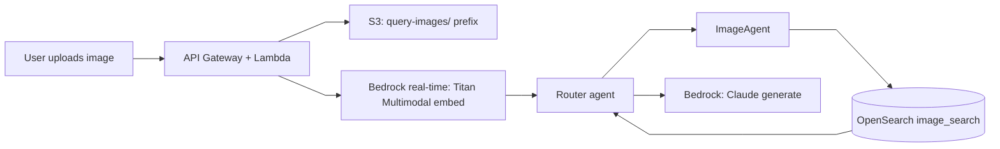

# 03 — Image Upload & Multimodal Query

## Overview

A user can upload a photo ("find products like this") instead of, or alongside, typed text.

**Addresses**: FR2 (image-based query), NFR-6 (security/privacy of uploads).

## Data flow

**Flow**:
1. Client uploads the image via a pre-signed S3 URL (avoids routing large binaries through Lambda)
2. API triggers a real-time Bedrock Titan Multimodal embedding call on the uploaded image (single item → real-time, not batch, same reasoning as query-time text embeddings — see [04](04-inference-serving.md))
3. The resulting vector is passed to the router as an additional input alongside any text the user typed ("find something like this, but in blue")
4. ImageAgent (see [02](02-retrieval-agents.md)) runs k-NN against the image-embedding field in OpenSearch; results combine with text-search results in the router's fusion step

## Decisions & reasoning

**Pre-signed upload, not a Lambda-proxied upload**: keeps large binaries off the Lambda request path entirely — the client uploads directly to S3, and the API only ever handles the resulting object key.

**Real-time embedding, not batch**: a single uploaded image needs its embedding in the time it takes to answer the request, not the minutes-to-hours turnaround of a batch job.

## Constraints enforced at upload

- File type allowlist: jpg, png, webp
- Size cap (e.g. 5MB) before the file reaches Bedrock
- TTL/lifecycle rule on the `query-images/` S3 prefix, so uploaded query images don't accumulate indefinitely

## Implementation notes

**Done for real, deployed and verified live** — `RagEcommerce-Upload` (CDK stack `infra/stacks/upload_stack.py`): two Lambdas (shared Docker image, `infra/lambda_containers/query_api/`, `cmd` overridden per function so the image is only built once) behind an HTTP API (`POST /upload-url`, `POST /query`).

**Pre-signed upload, matching the design exactly**: `POST /upload-url` (`src/api/presign_upload.py`) returns an S3 presigned POST scoped to `query-images/` (the prefix `DataStack` already had a 1-day expiry lifecycle rule on), with the file-type allowlist and 5MB size cap both enforced as real S3 policy `Conditions` — not just app-level checks a client could skip. Verified live: an unsupported content type (`application/pdf`) gets a 400 from the Lambda before ever asking S3; a real 6MB JPEG gets a real S3 `EntityTooLarge` 400 (`ProposedSize: 5246450, MaxSizeAllowed: 5242880`) on the upload itself; a real product's own image uploads successfully (204) via `requests.post` with the returned fields, for both JPEG and a real PNG (converted with macOS `sips`, not a synthetic fixture).

**Query API** (`src/api/submit_query.py` + `submit_query_handler.py`): `POST /query` takes a prompt and/or an uploaded image's `object_key`, fetches the object from S3, and invokes the router's AgentCore Runtime, collapsing its streamed SSE response (see [04](04-inference-serving.md)) into one JSON answer — deliberately not relayed as a second hop of streaming, since no frontend exists yet to consume it and Lambda-to-API-Gateway response streaming is a separate, heavier integration this workflow doesn't need yet.

**Real-time embedding, not batch** — unchanged from the original design's reasoning, though the actual model is Cohere Embed v4, not Titan Multimodal (Titan Multimodal isn't available on this account — see [01](01-ingestion-pipeline.md#image-embeddings-cohere-embed-v4-one-per-product)), and the embedding happens inside ImageAgent itself (eagerly, before its tool loop starts — see [02](02-retrieval-agents.md)), not in an upstream Lambda before handing off to the router. The upload API's job is just getting the bytes from the client to the router; ImageAgent still owns embedding, same as every other workflow 02 path into it.

**Three real bugs found and fixed while verifying this live** — none were caught by unit tests alone, all three needed an actual end-to-end request against deployed infrastructure:
1. **`bedrock:InvokeModelWithResponseStream` IAM gap** — already fixed in workflow 04 by the time this was built, but this is the workflow that exercises the router's streaming path through a real external caller (not just the AWS CLI) for the first time.
2. **`agentcore_client`'s default timeout was scoped to the wrong caller**: 20s is right for the router dispatching *to* a specialist, but `submit_query_handler.py` calls the *router itself*, whose full pipeline (routing + parallel dispatch + consolidation + streaming generation + verification) genuinely runs longer. A real image query hit `ValueError: Router response stream ended without a final event` — the connection was cut mid-stream. Fixed by parameterizing `agentcore_client(region, read_timeout=...)` and giving the Lambda's caller a 55s timeout (a few seconds under its own 60s function timeout) instead of reusing the specialist-dispatch default. See [src/agents/bedrock_client.py](../../src/agents/bedrock_client.py).
3. **Consolidation and generation were text-only even for an image-driven query**: the router told Claude "an image was provided" but never actually attached it to the consolidation or generation Converse calls. Claude couldn't judge ImageAgent's candidates against a reference image it couldn't see — consolidation returned a prose refusal instead of the requested JSON (a real `JSONDecodeError`, crashing the whole request), and once that was fixed, generation independently refused with "I'm unable to see or process images directly" despite already having the matched records to write from. Fixed by attaching the image to both calls (`converse_text`/`stream_answer` now take `image_bytes`+`image_format`) — see `src/agents/router_tools.py` and `src/agents/answer_generation.py`.

**Image format threading**: the upload allowlist accepts jpg/png/webp, but every downstream Converse image content block and Cohere's embed request used to hardcode `"jpeg"` regardless of what was actually uploaded — a silent mislabeling risk for a real PNG/WEBP upload (Cohere might embed it wrong, not necessarily error loudly). Fixed by deriving the real format from S3's `ContentType` on the fetched object (set by the presigned POST's own enforced `Content-Type` field) and threading it through `build_router_payload` → the router's payload/consolidation/generation calls → ImageAgent's own Converse call and its Cohere embed request. Verified live with a real PNG end-to-end (upload → embed → self-match retrieval → grounded answer), not just the JPEG happy path.

**Known limitation, not fixed further**: citation-marker insertion (`[[product_id]]`, see [04](04-inference-serving.md#implementation-notes)) is not 100% reliable — repeated identical image queries sometimes produced zero citations despite naming specific products in prose, even after strengthening the generator instruction. When a marker *is* present, `extract_citations` parses and resolves it correctly every time (verified across many live runs) — this is LLM instruction-following variance, not a parsing bug, and is the same general category as the existing CLAUDE.md gotcha about Claude not always following "respond with ONLY JSON." Not chased further here since it's a generation-prompt reliability question spanning every query type, not specific to image upload.

## Status

**Complete.** See [../PROGRESS.md](../PROGRESS.md).
